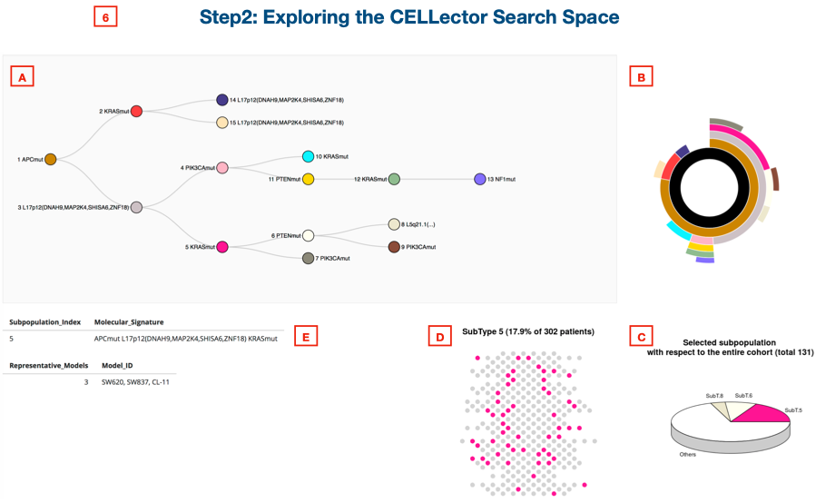

```{r setup, include = FALSE}
knitr::opts_chunk$set(collapse = TRUE, comment = "#>")
```
 <br> 


<br> <br> <br><br>
[CELLector R package interactive vignette](https://rpubs.com/francescojm/CELLector)

[CELLector manuscript example study case](https://rpubs.com/francescojm/CELLector_mans_ex)

[CELLector App online tutorial](https://rpubs.com/francescojm/CELLector_App)
<br> <br> <br><br>

## Introduction
<br>
CELLector App is a user friendly interface to [CELLector](https://github.com/francescojm/CELLector): a computational tool assisting experimental scientists in the selection of the most clinically relevant cancer cell lines to be included in a new in-vitro study (or to be considered in a retrospective study), in a patient-genomic guided fashion.

CELLector combines methods from graph theory and market basket analysis; it leverages tumour genomics data to explore, rank, and select optimal cell line models in a user-friendly way, through the [CELLector Rshiny App](https://github.com/francescojm/CELLector_app). This enables making appropriate and informed choices about model inclusion/exclusion in retrospective analyses, future studies and it makes possible bridging cancer patient genomics with public available databases froom cell line based functional/pharmacogenomic screens, such as [CRISPR-cas9 dependency datasets](https://score.depmap.sanger.ac.uk/) and [large-scale in-vitro drug screens](https://www.cancerrxgene.org/).

Furthermore, CELLector includes interface functions to synchronise built-in cell line annotations and genomics data to their latest versions from the [Cell Model Passports](https://cellmodelpassports.sanger.ac.uk/) resource. Through this interface, bioinformaticians can quickly generate binary genomic event matrices (BEMs) accounting for hundreds of cancer cell lines, which can be used in systematic statistical inferences, associating patient-defined cell line subgroups with drug-response/gene-essentiality, for example through [GDSC tools](https://gdsctools.readthedocs.io/en/master/).

Additionally, CELLector allows the selection of models within user-defined contexts, for example, by focusing on genomic alterations occurring in biological pathways of interest or considering only predetermined sub-cohorts of cancer patients. 

Finally, CELLector identifies combinations of molecular alterations underlying disease subtypes currently lacking representative cell lines, providing guidance for the future development of new cancer models.

License: GNU GPL v3

Najgebauer, H., Yang, M., Francies, H., Pacini, C., Stronach, E. A., Garnett, M. J., Saez-Rodriguez, J., & Iorio, F. CELLector: Genomics Guided Selection of Cancer in vitro Models. https://www.biorxiv.org/content/10.1101/275032v3

<hr>
<br> <br> <br><br>

## CELLector Running Modalities
<br>
CELLector can be used in three different modalities:

  - (i) as an R package (within R, code available at: https://github.com/francescojm/CELLector),

  - (ii) as an online R shiny App (available at: https://ot-cellector.shinyapps.io/CELLector_App/), 

  - (iii) running the R shiny App locally (within Rstudio, code available at:   https://github.com/francescojm/CELLector_App).

This page contains instruction to quickly try the package. User manual and package documentation are available at
https://github.com/francescojm/CELLector/blob/master/CELLector.pdf.

An **interactive vignette of the CELLector R package** is available [here](https://rpubs.com/francescojm/CELLector)

<hr>
<br> <br> <br><br>

## Selecting representative cancer cell lines
<br>
Click [here](https://ot-cellector.shinyapps.io/CELLector_App/) to launch the CELLector R Shiny App.

The user interface of the CELLector App is made of two main components implemented into two different tabs, respectively labelled with _Select Cell Lines_ and _BEM builder_.


To run CELLector analyses and to explore the results the first tab _Select Cell Lines_ tab should be selected (it is by default). By clicking on the second tab (_BEM builder_) a module for the generation of customised genomic binary event matrices (BEMs) for cell lines and tumours can be accessed (details in the sections below).

<br> <br> <br>

### Study case 1: Selecting microsatellite stable cell lines best representing TP53 mutant colorectal cancer patients with genomic alterations in 3 biological pathways
<br>
The _Select Cell Lines_ module interface displays seven boxes, detailed in the examples below.


In the first example study case we want to select 5 clinically relevant _in vitro_ models that best represent the genomic diversity of TP53 mutatant colorectal tumours. In addition, the models that we wannt to select should be microsatellite stable and should harbour at least one genomic alteration in the following signalling pathways: _PI3K-AKT-MTOR signalling_, _RAS-RAF-MEK-ERK/JNK signalling_ and _WNT signalling_. Finally, we want the model selection to be guided by somatic mutations and copy number alterations observed in at least 3% of the considered TP53 mutant tumour cohort. The summary results from this analysis are shown in Case Study Figure 1.

<br> <br>

#### Step 1: Setting up the search space building criteria and building the search space
<br>


CELLector provides built-in genomics data for matching primary tumours and cell lines derived from 16 cancer types. To start, we select a cancer type of interest from a dropdown list (as shown above) or alternatively, we can upload our own reference data by ticking the _User Defined Binary genomic Event Matrices (BEMs)_ box (as shown below). In this example case study, we select Colorectal Cancer (COREAD) (i) and we use the CELLector built-in data. 


Next, we have to specify some additional parameters determining the way the CELLector search space is constructed, or use their default values. In this example case study, we want to account for the genomic diversity of the studied cohort based considering both somatic mutations and copy number alterations (ii). Alteration set size is set to 1 (default setting; iii), meaning that the algorithm looks for only one alteration at the time that is the most prevalent while recursively identified tumour subpopulations. If the alteration set size is set to 2 (max 5), then the algorithm looks for co-occurring combinations of two (up to 5) alterations at the time while recursively identified tumour subpopulations. Lastly, we specify that the genomic signatures (e.g. the combination of co-occurring genomic alterations) underlying the identified tumour subpopulations have to be prevalent in at least 3% of patients in the studied tumour cohort (iv). 
These steps (ii, iii and iv) are essential to build the CELLector search space and to subsequently map representative in vitro models on it. If no other criteria are specified, the analysis is executed on the whole cohort of COREAD tumours (n=517) and considering the entire set of COREAD cell lines (n=51) available in the CELLector built-in datasets.
When user defined reference data (Box 1) is used, the following parameters: alteration set size and global support (Box 2) have to be specified before running the analysis (as shown above).

To flexibly tailor the model selection to the context of a specific study, users can reduce the tumour cohort to be analysed based on the status of an individual alteration (v), or alterations in cancer pathways (vi) or/and consider the microsatellite status of the cell lines (vii).

In this case study, we want to select cell lines that best represent a colorectal cancer patient sub-cohort that harbours TP53 mutation. In addition, models should harbour at least one alteration in the following signalling pathways: _PI3K-AKT-MTOR signalling_, _RAS-RAF-MEK_ERK/JNK signalling_ and _WNT signalling_ and are microsatellite stable.

Once the desire criteria (Box 2 and Box 3 if build-in datasets are used or Box 2 only if user defined reference data are used) are defined, we can start the analysis by clicking on the _Build Search Space_ button (viii). When the analysis is completed, infos regarding the number of primary tumours and cell lines considered in the current analysis are displayed in Box 5. The CELLector search space and the cell line selection results are then displayed in Box 6 (see below Step 3: Exploring the CELLector Search Space). The CELLector Search Space is then translated into a Cell Line Map table (as shown in the figure below) and can be downloaded as text file to a user specified location (ix). 


<font size="1"> **_Case Study Figure 1_** **A.** Visual representation of the CELLector search space summarising the genomic heterogeneity of TP53 mutant colorectal (COREAD) tumours, considering both somatic mutations and copy number alterations in user-defined biological pathways (user interface box 1 and box 2). Each node of the binary tree (top) represents a tumour subpopulation associated with a genomic signature. The prevalence of the identified signatures, and their hierarchical co-occurrence is represented by the sunburst (below the tree). Each segment of the sunburst corresponds to a node in the tree and is color-coded accordingly. The CELLector search space is built using genomic characterisation of a cohort of 517 colorectal cancer patient available as a built-in dataset. First, the cohort is reduced to the 302 tumours harbouring TP53 mutations. CELLector then identifies 3 major molecular subpopulations characterised, respectively, by APC mutations, KRAS mutations, and loss of a segment of chromosome 17 (at the 17p12 loci) that collectively represent 93% (n=243+26+12 = 281) of the studied tumour cohort. The remaining 7% of the TP53 mutant tumours (n=21) do not fall into any of the identified molecular subpopulations thus are not represented in the CELLector search space. The largest molecular subpopulation (80.46%, n=243, harbouring TP53 and APC mutations) is assigned to the root of the search space (node 1, in purple). The second largest subpopulation (9%, n=26) is characterised by co-occurrence of TP53 and KRAS mutations in absence of APC mutations (node 2, in magenta), and the third largest subpopulation (4%, n=12) harbours TP53 mutations and the loss of 17p12 segment in the absence of both APC and KRAS mutations (node 14, in cyan). Each of these complementary tumour subpopulations are then further refined based on the prevalence of the remaining set of molecular alterations. This process runs recursively and stops when all molecular alteration sets with user-determined tumour prevalence (in this case 3%, user interface box 1) are defined. In this study case, a total number of 15 distinct tumour subpopulations with defined genomic signatures are identified, when considering the TP53 mutant tumour sub-cohort and alterations in the selected pathways. **B.** Cell Line Map table including microsatellite stable cell lines mirroring the genomic signatures of the TP53 mutant COREAD tumour subpopulations identified in the CELLector search space (user interface box 2). The Cell Map table uncovers the complete set of molecular alterations (e.g. genomic signatures) that characterise each tumour subpopulation. For example, the least prevalent TP53 mutant colorectal cancer subpopulation (node 13, 3.64% of patients) is characterised by co-occurring mutations in APC, PIK3CA, PTEN, KRAS and NF1 in the absence of 17p12 segment loss; this genomic signature is not mirrored by any of the considered microsatellite stable (MSS) colorectal cancer models. The representative cell lines are picked from each of the molecular tumour subpopulations starting with the most prevalent one. The models in green represent a possible choice of n-user-defined cell lines that could be selected in the presented case study.</font>

<br> <br>

#### Step 2: Exploring the search space
<br>
CELLector provides a range of visualisation tools enabling users to interactively explore the CELLector search space (e.g. the identified tumour subpopulations with defined genomic signature) and the cell line selection results (Box 6), shown in the below figure. These include a binary tree (A), a sunburst (B), a pie chart (C), a dot plot (D) and a cell line information table (E).



When the search space building is completed, a binary tree, which represents the genomic diversity of the examined patient cohort, pops up in the bottom of the page. The root of this tree represents the largest tumour subpopulation and it has two sibling nodes. The upper node represents a population that is complementary to that represented by the parent node, while the lower node represents a refinement of the parent subpopulation. This definition applies recursively to each node. To search space is also visualised as an interactiev sunburst that takes into account of the prevalence of the identified genomic signatures and their hierarchical co-occurrence (B). Users can interactively explore both tree and sunburs. In the tree, nodes with a bold circle are expandable (not shown). If clicking on a node, the tumour subpopulation information relating to this node is displayed (in the figure abow information relating to selected node 5, in magenta, are shown). The segments of the sunburst (B), dot plot (D) and pie chart (C), which correspond to selected tumour subpopulation, are color-coded accordingly. The molecular signature of a tumour subpopulation is also shown below the tree, together with information regarding the number and names of cell line models that mirror this signature (E). This example subpopulation (node 5, in magenta) is defined by a combination of co-occurring mutations in TP53, APC, KRAS and losses of the 17p12 genomic segment and covers 17.9% of TP53 mutated tumours (as shown in E and D). There are 3 cell line modeliing this molecular signature (SW620, SW837, CL-11, as shown in E).

To enable easy navigation, the resulting CELLector searching space is translated into a Cell Map table (as shown in **_Case Study Figure 1B_**), which can be downloaded by clicking ‘Download Search Space’ (Box 1, iv).

<br> <br>

#### Step 3: Selecting cell lines
<br>
The last step in the CELLector analysis, after constructing the search space (Step 1), consist of selecting a user defined number of representative cell line models (Box 7).

The list of possible model choices (in this case example, made of 5 cell lines) is downloaded into a user-specified directory by clicking on _CELLect Cell Lines_. The outputted file provides information regarding the prevalence of the tumour subpopulations represented by the selected modelwith corresponding genomic signatures. The _Cell lines SubTypes Map_ can be also downloaded by clicking on the _Cell lines SubTypes Map_ button. Finally, the user can score  the representative ability of the cell lines by specifying how to weight the length of the signatures they account for and the size of the corresponding modeled patient sub-cohort (bottom of Box 7). Cell line scores are downloadable by clicking on _Score cell lines_.


<br> <br> <br>

### Study case 2: Unsupervised selection of microsatellite stable cell lines best representing colorectal cancer patients
<br>
In this case study, we want to select 5 microsatellite stable cell lines capturing the genomic heterogeneity of a cohort of colorectal cancer patients, focusing on sets of somatic mutations that are prevalent in at least 5% of the considered patient cohort. Setting up and building the search space as for the previus study case, yields the summary results shown in the figure below.


<font size="1"> **_Case Study Figure 2_** **A.** Visual representation of the CELLector search space constructed based on the prevalence of co-occurring mutations in a cohort of colorectal cancer (COREAD) patients (user interface box 1). Each node of the binary tree (top) represents a tumour subpopulation with a defined genomic signature. The prevalence of the identified signatures, and their hierarchical co-occurrence is represented by the sunburst (below). Each segment of the sunburst corresponds to a node in the three and is color-coded accordingly. The CELLector search space is assembled using a built-in dataset containing the genomic characterisation of a cohort of 517 colorectal cancer tumours (Table S1). CELLector identifies 2 major subpopulations defined by APC mutations (node 1, in purple) and TP53 mutations (node 2, in magenta), collectively representing 88% of the studied cohort (n = 396 + 59 = 455 patients). The remaining 12% of tumours (n = 21) do not fall into any of the identified molecular subpopulations, i.e. they do not harbour APC nor TP53 mutations. The largest molecular subpopulation (76.6%, n = 396, harbouring APC mutations) is assigned to the root of the search space (node 1). The second largest subpopulation (11.4%, n=59) is characterised by TP53 mutations in the absence of APC mutations (node 2). At this point, each identified tumour subpopulation is further refined based on the prevalence of other set of alterations. This process runs recursively and stops when all alteration sets with a user-determined prevalence (in this case 5%, user interface box 1) have been identified. In this case study, a total number of 10 distinct tumour subpopulations with corresponding genomic signatures are identified. Notably, some of the identified signatures (such as absence of APC mutations (~APCmut), co-occurrence of mutations in APC and TP53 (APCmut TP53mut), same combination with the addition of KRAS mutations (APCmut TP53mut KRASmut), and the co-occurrence of APC and KRAS mutations (APCmut ~TP53mut KRASmut) in the absence of TP53 mutations were reported to have a prognostic role in colorectal tumour stratification (Schell et al., 2016). **B.** Cell Line Map table including microsatellite stable cell lines mirroring the genomic signatures of the COREAD subpopulations identified in the CELLector search space (user interface box 2). The Cell Map table uncovers the complete set of molecular alterations (e.g. genomic signatures) defining each tumour subpopulation. For example, the least prevalent colorectal cancer subpopulation (node 8, 5.22% of tumours) is characterised by the co-occurrence of APC, TP53, KRAS, PIK3CA and PTEN mutations; this genomic signature is not reflected by any of the available microsatellite stable COREAD models included in the built-in dataset. The representative cell lines are picked from each of the molecular tumour subpopulations starting from the most prevalent one. The models in green represent a possible choice of n-user-defined cell lines that could be selected in the presented case study.</font>

<hr>
<br> <br> <br><br>

## Decoding identifiers of copy number alterations and hypermethylated gene promoters
<br>


If a user wishes to include copy number alterations (can) or hypermethylation (hsm) in the analysis (Box 3: Supervised Search Space Construction), CELLector provides a look up tables to search for genes that are within recurrently copy number altered chromosomal segments (Box 4) or downstreaming hypermethylated gene promoters (table not shown). 

<hr>
<br> <br> <br><br>

## Building genomic binary event matrices (BEMs)
<br>
CELLector allowing assembling _de-novo_ genomic binary event matrices from user defined genomic data, which can be used to perform CELLector analyses or with independent/external tools.

The _BEM Builder_ page displays two panels, respectively for _Primary tumours_ and _in-vitro models_ (as shown below).


<br> <br> <br>

### Building BEMs for primary tumours
<br>

BEMs for primary tumours can be generated using CELLector built-in variant catalogues from the [TCGA](https://portal.gdc.cancer.gov/) (using curated data from Iorio _et al_. 2016) or user own reference data. 

<br> <br>

#### Using built-in genomic datasets from the TCGA
<br>

To generate tumour BEMs from built-in TCGA data user should select the _use curated TCGA data from Iorio et al. 2016_ option (step 1) then select the cancer type of interest (step 2) then specify which genes and variants to consider (step 3). Supported options are _All_ genes/variants, Iorio _et al_.2016’ drivers/variants (in this case a set of high-confidence cancer driver genes generated by the [intOGen](https://www.intogen.org/) pipeline will be used), _CMP drivers_ (in this case high-confidence cancer driver genes used to annotate cell line genomic data on the [Cell Model Passport](https://cellmodelpassports.sanger.ac.uk/) and _User defined list_, for both genes and variants. Once all the parameters are specified, users shoul select the _BEM file format_ (R object or .tsv) and click on _Make new BEM_ (step 4). The information regarding the number of tumours and mutated genes used to generate the BEM will be displayed (as shown below), the BEM will be generated and saved to a user specified directory by clicking on on _Make new BEM_ and then on _Save BEM_ (step 5). 


<br> <br>

#### Using custom user-defined datasets
<br>

To generate tumour BEMs with custom user defined genomic data, users should select the _Upload Variants_ option (step 1), then select a file with the variants (a tab delimited txt file with two columns, respectively for gene symbols and aminoacid substitutions) (step 2), the select the file format (R object or .tsv) and click on _Make new BEM_ (step 3). The information regarding the number of tumours and mutated genes used to generate the BEM will displayed, the BEM generated, and saved to user specified directory by clicking on _Make new BEM_ and then on _Save BEM_ (step 4). 


<br> <br> <br>

### Building BEMs for _in vitro_ models
<br>

BEMs for in vitro models can be generated using variant catalogues from the [Cell Model Passport (CMPs)](https://cellmodelpassports.sanger.ac.uk/) or custom user-defined data. 

<br> <br>

#### Using data from the [_Cell Model Passport_](https://cellmodelpassports.sanger.ac.uk/)
<br>

To generate BEMs for in vitro models using variant catalogue from [Cell Model Passport (CMPs)](https://cellmodelpassports.sanger.ac.uk/), users should select the _use Variant Catalogue from Cell Model Passports (CMPs)_ option (step 1) then specify what types of models they are interested in (step 2), based on parameters such as tissue of origin, cancer type and subtypes, age, ethnicity, ploidy etc. Infos on available models based on the selected parameters will be displayed on the top of the panel (step 3).
The information regarding the number of tumours and mutated genes used to generate the BEM will displayed.


In the example below, we demonstrate how to generate models BEM for breast carcinoma cell lines derived from ascites, breast, mammary gland, peripheral fluid and pleural effusion. Applying these criteria, the number of available models is reduced from 50 (shown above, top panel step 3) to 10 (shown below, top panel step 3). Then we need to specify what genes and variants to consider. Supported options are (as for the previous cases) _All_ genes/variants, _Iorio et al.2016_  drivers/variants, Cell Model Passports _CMP drivers_ and _User defined list_ for both genes and variants. Once all the parameters are specified, select BEM file format (R object or .tsv) and click ‘Make new BEM’ (step 4). The information regarding the number of tumours and mutated genes used to generate the BEM will display in a box below (as shown below), the BEM generated, and saved to user specified directory by clicking on _Make new BEM_ and then on _Save BEM_ (step 4). 


<br> <br>

#### Using custom user-defined datasets
<br>

To generate in vitro model BEMs using custom user defined genomic data, user should select the _Upload Variants_ option (step 1), then select the data from your local directory (step 2, formatted as specified in BEM for primary tumours section), then select the BEM file format (R object or .tsv) and then click on _Make new BEM_ (step 3). The information regarding the number of models and mutated genes used to generate the BEM will displayed. Finally, once the BEM is generated, it is saved to user specified directory by clicking _Save BEM_ (step 4).


<hr>
<br> <br> <br><br>

## Using the CELLector App locally
<br>
To use the CELLector App locally, its code should be downloaded as a single compressed folder from
https://github.com/francescojm/CELLector_App/archive/master.zip.
Once the folder has been downloaded, it should be uncompressed. Then [Rstudio](https://www.rstudio.com/) should be launched with the working directory set to the uncompressed folder with the CELLector App code (as shown in the figure below).


To launch the App, _global.R_ file should be open and the _Run App_ tab (in the top-right corner of the code window in Rstudio) should be clicked. All the required libraries will be automatically installed, alternatively they can be downloaded from (CRAN or Bioconductor) and installed manually as/if requested by the consolle.

Once the App is launched, we encourage to open it in a web-browser to optimize the visualisation capabilities, by clicking on the _Open in Browser_ tab in the Rstudio App window.


<br> <br> <br><br>

## Manuscript high-level example study case reported in Figure 1DE

<br><br>

**Selecting Microsatellite Instable Cell Lines Representing BRAF Mutant Colorectal Cancers**

We present a practical example to demonstrate the usefulness of CELLector in an experimental study design. Detailed instructions on other use cases are provided in this tutorial.
In this example, we want to identify the most clinically relevant microsatellite instable cell lines (CLs) that capture the genomic diversity of a sub-cohort of colorectal cancer patients that harbour BRAF mutations. BRAF mutant colorectal cancers have a low prevalence (5%-8%) and very poor prognosis. In this example, the model selection will be performed accounting for somatic mutations that are prevalent in at least 5% of the considered colorectal patient cohort (Figure 1DE: box 1 and box 2).

<br> <br> <br><br>


<br> <br> <br><br>

### Building the CELLector search space

<br><br>

After setting the CELLector app parameters to reflect the search criteria, the CELLector search space is assembled using a built-in dataset containing the genomic characterisation of a cohort of 517 colorectal cancer tumours (Table S1 and STAR Methods). 

<br>

First, the cohort is reduced to the tumours harbouring BRAF mutations (n=86, Figure 1D: node 1). CELLector then identifies 3 major molecular subpopulations characterised, respectively, by APC mutations (Figure 1D: node 2), FBXW7 mutations (Figure 1D: node 3), and PIK3CA mutations (Figure 1D: node 10), collectively representing 85% of the BRAF mutant cohort. The remaining 15% of BRAF mutant tumours do not fall into any of the identified molecular subpopulations, i.e. they do not harbour APC, FBXW7 nor PIK3CA mutations; Figure 1D). 

<br>

The largest molecular subpopulation (58.14%, harbouring BRAF and APC mutations) is assigned to the root of the search space (Figure 2A: node 2, in purple). The second largest subpopulation (16.28%) is characterised by the co-occurrence of BRAF and FBXW7 mutations in the absence of APC mutations (Figure 2A: node 3, in magenta), and the third largest subpopulation (10.47%) harbours the BRAF and PIK3CA mutations in the absence of both APC and FBXW7 mutations (Figure 2A: node 10, in cyan). At this point, each identified tumour subpopulation is further refined based on the prevalence of the remaining set of alterations (STAR Methods). This process runs recursively and stops when all alteration sets with a user-determined prevalence (in this case 5%, Figure 1D: box 1) are identified. In this study case, a total number of 10 distinct tumour subpopulations with corresponding genomic signatures are identified.

<br><br><br>

#Selection of representative in vitro models

<br><br>

The CELLector search space generated as detailed in the previous section is next translated into a Cell Line Map table (Figure 1E), indicating the order in which cancer in vitro models mirroring the identified genomic signatures should be selected, and accounting also for tumour subpopulations currently lacking representative in vitro models. This selection order is defined by a guided visit of the CELLector search space (introduced in the previous sections and detailed in the STAR Methods), aiming at maximising the heterogeneity observed in the studied primary tumours. The Cell Map table uncovers the complete set of molecular alterations (e.g. genomic signatures) defining each tumour subpopulation (in this example n=10). For example, a BRAF mutant colorectal tumour subpopulation (node 8, 9.30% of tumours) is characterised by the co-occurrence of BRAF, APC, PIK3CA, PTEN, TP53 and KRAS mutations; this genomic signature (BRAFmut APCmut PIK3CAmut PTENmut TP53mut KRASmut) is not mirrored by any of the available microsatellite instable colorectal cancer models included in the built-in dataset. On the contrary, the subpopulation characterised by the co-occurence of BRAF, APC and TP53 mutations in absence of PIK3CA mutations (BRAFmut APCmut ~PIK3CAmut TP53mut, node 5, 15.12% of tumours) is represented by microsatellite instable KM12 and LS-411N CLs (Figure 1E).   

<br>

Finally, representative CLs are picked from each of the molecular tumour subpopulations (as detailed in the STAR Methods) starting from the most prevalent one, i.e. as they appear in the Cell Line Map table. A possible choice of in vitro models that best represent the genomic diversity of the studied tumour cohort include: LS-411N, SNU-C5, RKO and KM12 (Figure 1E shown in green). Additional case studies are available in the CELLector App online.


